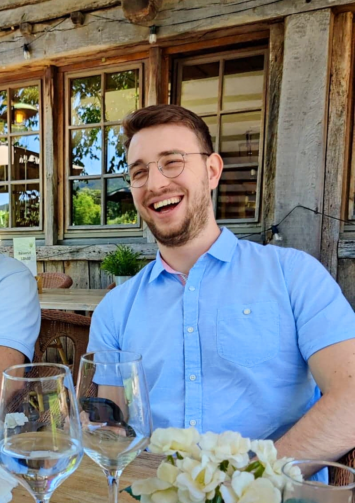

# Quentin Rouchet 

*Life is like riding a bicycle. To keep your balance, you must keep moving.*
*-Albert Einstein*

## Me, in one sentence

|Birthday|21/11|
|---|---|
|Favorite color|Blue|
|Favorite food|Fries and hamburger for sure|
|Pinneaple on pizza|- [ ]|

## Hobbies

- Video games 
    * Apex 
    * Minecraft 
    * Minecraft Dungeon (really love it)
- Guitar
- Making some graphic design 
- And obviously coding

## You can always count on me when you want to finish your fries

I think i can help the group with some layout issues and maybe help to feel confortable.

## A funny story

When i was younger, i was a big fan of my Playstation 2. And a day, someone of name I won't tell shoot in my brand new Playstation ! And after that my favorite console didn't work anymore... It's not a funny story i know. But now she works again ! So it's a funny story.

### TL;DR

My playstation 2 still work !

[Olivia la bro](https://github.com/OliviaDemaret/markdown-challenge) || [Quentin Rouchet](https://github.com/QuentinRouchet/markdown-challenge) || [Romain le boss](https://github.com/Zaddes/markdown-challenge)